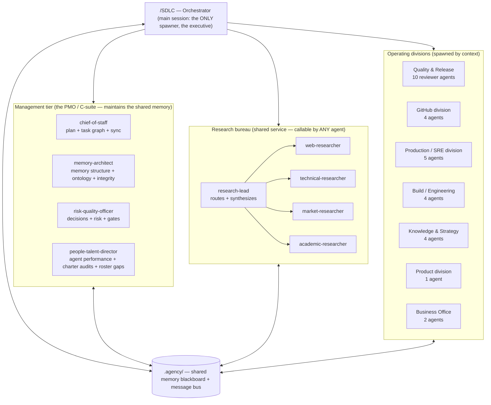

# The Agency — an agent corporation for Claude Code

A hierarchy of specialized agents that behaves like a tech company: a management layer keeps everyone in sync, a research bureau serves the whole org on demand, and operating divisions (Quality, GitHub, Production, Build, Knowledge, Product, Business Office) do the work. Agents are **spawned by context** — only the roles a task needs show up — and they coordinate through a shared, structured **memory blackboard** (`.agency/`) rather than by talking directly.

This document is the constitution: the org chart, the hierarchy, the workflow ontology, and the communication protocol. Every agent reads `.agency/README.md` (the operating protocol) on startup; this file is the human-facing "why."

**One engine, several agencies.** The same blackboard engine runs more than one agency, each its own orchestrator command with a distinct remit. They share the `.agency/` memory, the COMMS protocol, and the single-writer discipline; they differ in what they're allowed to produce:

| Agency | Command | Remit | Boundary |
|---|---|---|---|
| **SDLC Agency** | `/SDLC` | the full build-out — research → build → review → ship | can take real, irreversible actions (deploy/push) — gate-and-hook governed |
| **Design Agency** | `/SDLC-design` | **prototypes & concepts only** (2–5 distinct, comparable HTML options per ask; ≥1 net-new persona, logged in `state/design-personas.md`) | **never writes production code**; reads/writes `memory/design-system.md` |
| **GTM Agency** | `/SDLC-gtm` | go-to-market: push to launch, get real signal | **agents draft; the user executes** spend/publish/post; every estimate cites real signal in `state/gtm-evidence.md` |
| **Explanation Agency** | `/SDLC-explain` | teach ONE topic deeply — intuition→formalism with a real cited case study (story-driven read and/or interactive 3Blue1Brown-style HTML) | **never production code**; writes explanation artifacts only |
| **Blog Agency** | `/SDLC-blog` | one Medium-ready technical post in **the user's voice** per `memory/blog-voice.md`, researched live, every fact cited | **drafts only — the user publishes**; never production code |

New agencies follow the same shape: an orchestrator command (remit + the operating cycle) plus a few specialist agents, all coordinating through this blackboard. The sections below describe the engine all agencies share.

---

## 1. The one constraint that shapes everything

In Claude Code, **a subagent cannot spawn another subagent — only the main session can.** A literal tree where a manager agent spawns workers who spawn researchers is therefore impossible as live nested calls.

The Agency turns this constraint into its architecture. The **main session is the executive function** — the only spawner. It is driven by the `/SDLC` orchestrator command. Hierarchy, delegation, and "calling" another agent are all expressed through **shared memory + an asynchronous message bus**, exactly like a real company runs on its intranet, ticket system, and shared drive rather than everyone being in one room. This is the *blackboard pattern*, and it is more robust than nesting would be: it persists across sessions, it's auditable, and any agent can be restarted with full context.

---

## 2. Org chart



The arrows from the orchestrator mean "spawns." The arrows to the blackboard mean "reads/writes." Agents never call each other directly — they leave work on the blackboard and the orchestrator routes it.

---

## 3. The hierarchy (who sits above whom, and why)

Authority in the Agency = **whose memory other agents must respect.**

1. **Orchestrator (executive).** Sets the mission, decides the roster for each cycle, spawns agents, and enforces gates. Final authority. Never delegates the go/no-go.
2. **Management tier (above all workers).** The chief-of-staff's task graph and the risk-quality-officer's gates are binding on every division. The memory-architect's structure is binding on how everyone writes memory. Management plans *before* workers act and reconciles *after*.
3. **Research bureau (a cross-cutting service that sits "above" delivery in the sense that its findings inform every decision).** Any agent may request research; the research-lead prioritizes the queue and the orchestrator fulfills it. Research is deliberately a shared utility so the whole system stays current and the agents stay domain-agnostic — the same bureau serves a market-research task and a database-tuning task.
4. **Operating divisions (workers).** Execute within their domain, escalate blockers upward via the risk register, and consume research and standards from above.

Escalation path: **worker → risk register → risk-quality-officer → orchestrator.** Nothing is silently dropped.

---

## 4. Communication protocol (inter-agent and intra-agent)

**Inter-agent (between agents) — asynchronous, via the blackboard.** The shared memory *is* the communication channel. The full message protocol — envelope, types, channels, tickets, routing — lives in **`COMMS.md`**; the essentials:

- A worker that needs something it can't produce (current data, a decision, another division's output) emits a **request** envelope *in its report*. It does not wait — it records the dependency and continues or yields. The orchestrator files it as a ticket on the **Linear-style board** (`.agency/bus/tickets.md`) with a thread (`.agency/bus/threads/<ticket-id>.md`).
- The orchestrator drains the ticket queue between spawn batches and **fulfills** each request by spawning the right agent (e.g. a research request → spawn the matching researcher), routes the result to the requester's inbox (`.agency/bus/inbox/<agent>.md`), and closes the ticket. Org-wide notices go to **Slack-style channels** (`.agency/bus/channels/`).
- Every meaningful action lands in the **event log** (`.agency/bus/events.md`) — the audit trail that lets anyone reconstruct what happened. Workers report their events; only the serial owners append them — `chief-of-staff` at RECONCILE and the orchestrator at SERVE — and since those steps never overlap and an append never rewrites earlier lines, there's no concurrent writer.
- **Single-writer discipline:** parallel agents never edit the same shared file (that would silently overwrite). Each writes only its own `artifacts/` and uniquely-named memory files; everything bound for a shared file goes in the report, and the file's owner merges it during the serial SERVE/RECONCILE steps. See the concurrency rule in `README.md`.
- **Synchronization** is achieved because every agent reads `mission.md` + `status-board.md` + its relevant memory *before* acting, and reports back *after*. The management tier reconciles the board each cycle so the "single source of truth" never drifts.

**Intra-agent (within one agent) — structured handoff.** Each agent decomposes its own task, keeps its working notes in `.agency/artifacts/<task-id>/`, and emits a structured handoff (what it did, decisions, artifacts, blockers, recommended next agents) so the next agent — or a future restart of itself — picks up cleanly. Because subagents start fresh with no memory of the conversation, this written handoff is not optional; it's how the org "remembers."

---

## 5. The shared memory (`.agency/`) — the company intranet

```
.agency/
├── README.md              # operating protocol — EVERY agent reads this first
├── AGENCY.md              # this file — architecture / org chart / rationale
├── COMMS.md               # the message protocol (envelope, types, channels, tickets, routing)
├── org-chart.md           # the roster + who owns what (the actor ontology)
├── mission.md             # the current objective, scope, constraints (set per run)
├── state/
│   ├── task-graph.md      # the master task DAG: tasks, owners, deps, status   (chief-of-staff)
│   ├── status-board.md    # live kanban: backlog / doing / blocked / done      (chief-of-staff)
│   ├── decisions-log.md   # ADRs and decisions with rationale                 (risk-quality-officer)
│   ├── risk-register.md   # open risks, blockers, severities, owners          (risk-quality-officer)
│   ├── design-needs.md    # first-class design needs captured at PLAN          (orchestrator)
│   ├── reporting.md       # reporting rules + engine gate (delivery location/format/cadence)  (orchestrator)
│   ├── design-personas.md # ledger proving ≥1 net-new persona per design ask   (/SDLC-design)
│   └── gtm-evidence.md    # real-world signal ledger every GTM estimate cites  (/SDLC-gtm)
├── memory/
│   ├── index.md           # the map of memory — where everything lives         (memory-architect)
│   ├── ontology.md        # shared vocabulary + entity/relationship model (incl. product & design domain)
│   ├── standards.md       # coding/security/quality + design-conformance + GTM-evidence baselines
│   ├── design-system.md   # Token/Component/Pattern/InteractionConvention registry (Design Agency)
│   ├── facts/             # durable domain knowledge, one file per topic
│   └── research/          # research briefs (the research bureau writes here)
├── bus/
│   ├── tickets.md         # Linear-style board: the work + open requests        (orchestrator)
│   ├── events.md          # append-only event log (audit trail)   (chief-of-staff @RECONCILE + CEO @SERVE)
│   ├── channels/          # Slack-style channels: general/research/incidents/releases
│   ├── threads/<ticket-id>.md # per-ticket conversation (request → reply → follow-ups)
│   └── inbox/<agent>.md   # directed messages to a specific role               (orchestrator routes)
└── artifacts/<task-id>/   # working files and outputs produced by agents
```

It's plain Markdown by design: disposable, diffable, version-controllable, and readable by you and every agent. The memory-architect keeps it from rotting (dedupes, archives, maintains the index and ontology).

---

## 6. The operating cycle (how a run actually executes)

The orchestrator runs the company in cycles, like sprints:

```
0. PRE-FLIGHT  Orchestrator confirms a clean, current environment before anything else:
               check current status (active mission/board), a clean tree on a current base
               (fetch-first vs the remote default; branch/stash dirty WIP; sync if behind),
               the latest reference material loaded (plan/designs/standards), and a clean
               test env (/test-env). Gate — do not start dirty or stale. (Garry Git owns this
               when installed.)
1. INTAKE      Orchestrator writes mission.md (objective, scope, blast radius, constraints).
2. PLAN        Spawn chief-of-staff → produces/updates task-graph.md + status-board.md.
               Spawn memory-architect (if memory is cold) → seeds index/ontology/standards.
3. STAFF       Orchestrator selects the roster for THIS cycle from the task graph
               (context-driven — only the agents the open tasks need). Spawn them in
               PARALLEL batches, each with a bounded scope + the mission framing.
4. EXECUTE     Workers do their tasks; file research/cross-division requests to the bus;
               write outputs to artifacts/ and status to the board.
5. SERVE       Orchestrator drains bus/tickets.md → spawns research-lead / specialists to
               fulfill, routes results to inboxes, closes the ticket.
6. RECONCILE   Spawn the management tier → update task graph, log decisions, update risk
               register, dedupe memory. Re-evaluate gates.
7. GATE        Orchestrator checks exit criteria. If blockers remain → loop to STAFF.
               If clean → deliver verdict/result. If mission complete → close out + retro.
```

Not every cycle uses every tier. A small task might be PLAN → one worker → RECONCILE. A production incident jumps straight to the Production division with the incident-commander leading. **Spawn only what the context needs** — that's both cheaper and clearer.

---

## 7. The full roster (53 agents + orchestrators)

**Orchestrators (slash commands):** `/SDLC` (the full build-out cycle, the only spawner; auto-scaffolds `.agency/` + augment preflight), `/SDLC-mini` (**Ori Orc** — the lightweight version for small, single-thread tasks: same engine + safety rails, no project plan/management tier; escalates to `/SDLC` when a job outgrows it) *(planned — ships separately)*, `/SDLC-finish` (teardown), `/SDLC-design` (Design Agency — prototypes/concepts only), `/SDLC-gtm` (GTM Agency — launch + real signal), `/SDLC-explain` (Explanation Agency — teach one topic deeply), `/SDLC-blog` (Blog Agency — one post in the user's voice). All run the same blackboard engine; each is the sole spawner for its run.

**Management tier (4):** `chief-of-staff`, `memory-architect`, `risk-quality-officer`, `people-talent-director` (CHRO for the agent workforce — performance reviews from the invocation usage-ledger, charter audits, roster gap analysis; proposes, never applies).

**Research bureau (5):** `research-lead`, `web-researcher`, `technical-researcher`, `market-researcher`, `academic-researcher`.

**Quality & Release division (10):** `architecture-reviewer`, `ux-reviewer`, `code-quality-reviewer`, `security-reviewer`, `privacy-reviewer`, `testing-reviewer`, `cicd-reviewer`, `sre-scalability-reviewer`, `observability-reviewer`, `docs-release-reviewer`.

**GitHub division (4):** `repo-steward`, `pr-manager`, `issue-triage`, `release-tagger`.

**Production / SRE division (5):** `deploy-operator`, `monitoring-watch`, `incident-commander`, `recovery-engineer`, `support-engineer` (user-facing FAQ / troubleshooting KB / onboarding / known-issues — staffed before DELIVER of user-facing work and post-incident).

**Build / Engineering division (4):** `frontend-engineer`, `backend-engineer`, `database-engineer`, `optimization-engineer`.

**Knowledge & Strategy division (4):** `ontology-engineer`, `knowledge-graph-engineer`, `business-strategist`, `data-analyst` (metric trees, dashboard specs + queries, experiment readouts).

**Product division (1):** `product-manager` (PRD + story backlog at PLAN — the upstream artifact every build mission consumes; pairs with the Design Agency).

**Business Office (2):** `finance-analyst` (TCO / unit economics / pricing / build-vs-buy economics), `legal-compliance-counsel` (OSS license audits, ToS/privacy-policy drafts, regulatory checklists — drafts only, never legal advice; escalates straight to the orchestrator like a real GC).

**Design Agency (5):** `design-lead`, `design-explorer`, `design-researcher`, `design-system-specialist`, `design-systems-engineer`.

**GTM Agency (6):** `gtm-lead`, `gtm-strategist`, `gtm-builder`, `user-testing-coordinator`, `content-marketer` (long-form owned media: launch posts, SEO briefs, editorial calendar — marketing content; the user's personal-voice essays belong to the Blog Agency), `sales-engineer` (demo scripts, POC plans, RFP/security-questionnaire answer bank).

**Explanation Agency (2):** `explainer-narrative`, `explainer-visual`.

**Blog Agency (1):** `blog-writer` (**Blaise Blog** — Medium-ready posts in the user's voice per `memory/blog-voice.md`; drafts only, the user publishes).

Tally: 4 + 5 + 10 + 4 + 5 + 4 + 4 + 1 + 2 + 5 + 6 + 2 + 1 = **53 agent charters on disk** (`agents/*.md`).

Each agent's full charter is its file in `agents/`. They are deliberately lean because the heavy shared logic lives once in `.agency/README.md`.

---

## 8. Why it's domain-agnostic

Nothing above is specific to shipping software. The same machine runs a **market-research** project (orchestrator → market-researcher + academic-researcher + business-strategist → management reconciles into a strategy brief), an **ontology build** (ontology-engineer + knowledge-graph-engineer + research bureau), or a **production launch** (Quality + GitHub + Production divisions). The mission and the task graph change; the hierarchy, memory, and protocol stay the same. That's what makes it reusable as a general "agent company," not just a release tool.

---

## 9. Corporate patterns deliberately included

- **Governance:** an ADR/decisions log and binding standards (memory/standards.md).
- **Audit trail:** the append-only event log.
- **Onboarding:** `.agency/README.md` brings any freshly-spawned agent up to speed in seconds — essential because subagents start with no memory.
- **RACI / ownership:** org-chart.md assigns an owner to every function and memory file.
- **Risk & escalation:** the risk register with a defined escalation path.
- **Capacity discipline:** context-driven staffing — don't spawn the whole company for a one-file change.
- **Continuous improvement:** a retro step at close-out writes lessons to memory/facts so the next run is smarter.
- **Separation of duties:** the agent that builds is not the agent that approves the gate (Quality division reviews Build division's output).

See `INSTALL.md` to set it up and run your first mission.
