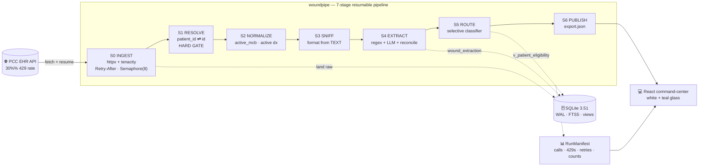
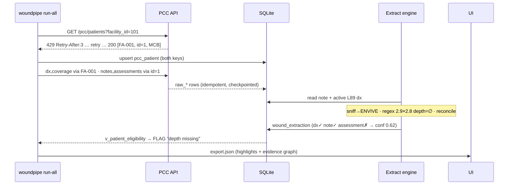
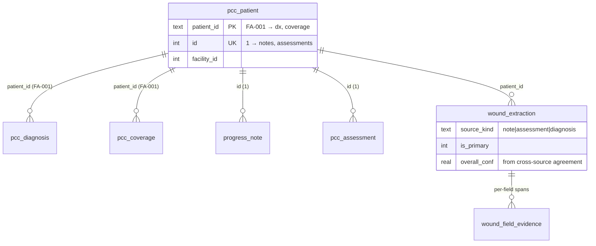

<div align="center">

# 🩹 woundpipe

### Wound-Care Medicare Part B Billing-Triage Pipeline

**Pull messy EHR data through a 30%-failure API → extract wound clinical facts from four note formats → route every patient `auto_accept` / `flag_for_review` / `reject` with a plain-English reason — and show a biller exactly what to act on, and why.**

     

</div>

---

## ✨ Why this exists

Post-acute wound care is the **highest-denial documentation problem in SNF billing** — denial rates run 25–35%, and the cause is almost never the code, it's a **missing measurement** invisible until the claim bounces. A biller manually opens hundreds of charts in PointClickCare, reads four inconsistent note formats, cross-checks coverage and diagnoses, and guesses what's billable.

`woundpipe` automates the data collection and triage so the biller sees, at a glance:

> **`FA-001 · Agnes Dunbar` — `FLAG` — Depth not documented and only the note describes the wound. Confirm before billing.**

…and can click through to the **original note with the extracted fields highlighted in place** and a **graph of which sources agree**.

The guiding principle: **flag, don't hallucinate.** We would rather route an ambiguous wound to a human than invent a depth measurement that turns into a denied claim.

---

## 🏛️ Architecture



### Data flow for one patient (`FA-001`)



### The data model (two-identity trap, made first-class)



> **`v_patient_eligibility`** and **`v_wound_corroboration`** are SQL **views** — the eligibility table is a *live query*, never a stale dump.

---

## 🔬 How it works

| Concern | Approach |
|---|---|
| **30% 429 API** | `httpx` + `tenacity`: honor `Retry-After` on 429, exp+jitter on 500/timeout, **422 fail-fast**; bounded `Semaphore(8)` with the permit **held across retry sleeps** (anti-storm); every call checkpointed in `fetch_log` → crash at call 700 resumes only the remaining 500. |
| **Two patient IDs** | `patient_id` (`FA-001`) keys diagnoses/coverage; integer `id` keys notes/assessments. Resolved once in a **hard gate** before any fan-out — wrong-key 422s are structurally impossible. |
| **4 messy note formats** | Format detected from the **text**, not the (misleading) `note_type`. **Regex owns measurements** (it returns a literal substring or null — never invents a number); an **LLM lane** (Claude, optional) owns Envive prose comprehension and multi-wound primary selection, behind a **verbatim-span gate** that drops any hallucinated measurement. |
| **Trust / confidence** | Not the LLM's self-report. Confidence = **cross-source agreement**: when the ICD-10 diagnosis, the note, and the assessment describe the *same* wound, confidence is high. This is the backbone of both the routing decision **and** the evidence-graph visual. |
| **The decision** | A glass-box **selective classifier** with cost-asymmetric thresholds (Chow): `auto_accept` only when complete **and** corroborated; everything ambiguous routes to a **wide `flag` region**; `reject` for not-MCB / no-wound / unparseable. Realized as the `v_patient_eligibility` SQL view, with a Python oracle that CI asserts is equivalent. |
| **Schema management** | Versioned `migrations/NNN_*.{up,down}.sql` + a `PRAGMA user_version` runner, expand/contract discipline, and a **tested up→down→up rollback**. |

---

## 🚀 Quickstart

```bash
# 1. install
python -m venv .venv && source .venv/bin/activate
pip install -e .                      # add ".[llm]" for the optional Claude lane

# 2. run the whole pipeline against the live API (resilient + resumable)
woundpipe run-all --db data/woundpipe.db
#   init-db → ingest (≈1,200 calls through the 429 storm) → extract → route → publish

# 3. see the dashboard
cd frontend && npm install && npm run dev      # reads data/export.json
```

Individual stages are independently re-runnable (and resume):

```bash
woundpipe init-db
woundpipe ingest --facilities 101,102,103        # add --since <ISO> for incremental
woundpipe extract
woundpipe route                                   # prints the routing distribution
woundpipe publish --out data/export.json
```

> No `ANTHROPIC_API_KEY`? The **deterministic regex lane is the floor** — the pipeline runs and routes everything without an LLM. The Claude lane is pure upside.

---

## 🖥️ The dashboard (white + teal glass)

A Vite + React 19 + Tailwind v4 SPA that reads a **static `export.json`** (zero backend to crash mid-demo):

- **Command Center** — count-up KPI glass cards, a live React-Flow pipeline graph, a payer→eligibility→route Sankey.
- **Triage Queue** — TanStack table, color **+ icon** routing, a confidence gauge, plain-English reasons, instant search/filter.
- **Patient Detail** — the original note with **extracted fields highlighted in place**, the three eligibility checks, and the **evidence graph** (green = agree, red = conflict).
- **Pipeline Flow** — per-stage counts with the **429 retry rendered amber → green**, and a 300 → eligible → auto_accept funnel.

---

## 🗂️ Project structure

```
src/woundpipe/
  config.py  errors.py  logging.py  models.py      # shared contracts
  db/        engine.py  migrate.py                  # WAL + user_version runner
  ingest/    client.py  fetch.py  checkpoint.py     # resilient fetch + resume
  resolve/   identity.py                            # two-identity hard gate
  extract/   sniff.py regex_lane.py llm_lane.py reconcile.py engine.py
  route/     eligibility.py                          # SQL-view execution + Python oracle
  publish/   export.py                               # export.json
  observability/ manifest.py                          # RunManifest
  cli.py                                              # Typer: init-db|ingest|extract|route|publish|run-all
migrations/  001_initial_schema.{up,down}.sql  002_wound_field_evidence.{up,down}.sql
frontend/    React 19 + Vite + Tailwind v4 (white/teal glass)
tests/       extraction · routing oracle · view↔oracle equality
```

---

## ✅ Testing

```bash
pytest -q          # extraction correctness · routing oracle · SQL-view↔oracle equality (R5)
```

Acceptance highlights enforced: resilient/resumable ingest, **no fabricated measurements** (every numeric is a literal substring of its source), every routed patient has a non-empty reason, and the SQL routing view agrees with the Python policy oracle.

---

## 🔭 From hackathon to MVP

Built as an MVP, not a throwaway: schema-managed, idempotent, resumable, observable. The roadmap — audit trail, human-in-the-loop threshold calibration on a labeled gold set, incremental `since` sync, real PCC integration under a BAA — is documented in [`.agency/artifacts/MASTER-BLUEPRINT.md`](.agency/artifacts/MASTER-BLUEPRINT.md) and [`.agency/artifacts/SPEC.md`](.agency/artifacts/SPEC.md).

> **Compliance:** synthetic data only, no PHI. HIPAA-ready by design — no PHI in logs, least-privilege, an audit trail per decision.

---

<div align="center">
<sub>Built with the Agency · grounded in the live API · every load-bearing claim verified, not asserted.</sub>
</div>
